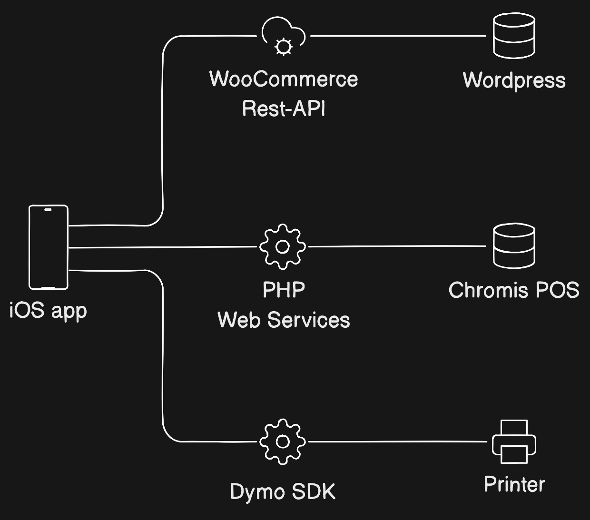

# SwiftUI with ChromisPOS and WooCommerce

## A mini inventory management app has been designed with a single page for updating essential product information.


## System overview
The app comprises 3 main functions: updating products in the ChromisPOS database using the PHP service API, updating product selling prices and stock quantities in the WordPress database via the WooCommerce Rest API, and printing out product shelf labels using the Dymo printer SDK.


## Functions
- Retrieve, insert, and update product information, such as product ID, code, name, image, category, taxes, purchase price, selling price, stock quantity, and expiration, from the ChromisPOS database.
- Retrieve and update product information, such as selling price and quantity, from the WordPress database.
- Scan product barcode
- Searching
- Print product shelf label

## Setup
1. Set up your Apache and PHP environment, and then move the 'service' folder to the DocumentRoot path
2. Install [Chromis POS](https://chromis.co.uk/) or you can edit the SQL query to match the database you require.
3. Create a table name `product_stock` in chromispos database
```sql
CREATE TABLE `products_stock` (
  `ID` varchar(255) NOT NULL,
  `STOCK` double DEFAULT '0',
  `EXPIRATION` date DEFAULT '0000-00-00'
) ENGINE=InnoDB DEFAULT CHARSET=utf8;
```
4. Install the DYMO printer driver. I used the DYMO LabelWriter 450 Label Printer. If you have a different model, you can edit the label template file for your printer at `service/dymo/template.label`.
5. Create WooCommerce Rest API keys:
   - WooCommerce->Setting->Advance->REST API->Add Key
   - Set permission to `Read/Write` then
   - Click `Generate API Key`
   - Save `Consumer key` and `Consumer secret` for App setting

## Tweak this project
It would be nice if the project could remove the background from product images using image processing.

## Find a bug
If you found an issue or would like to submit an improvement to this project, please submit an issue using the issue tab above.
